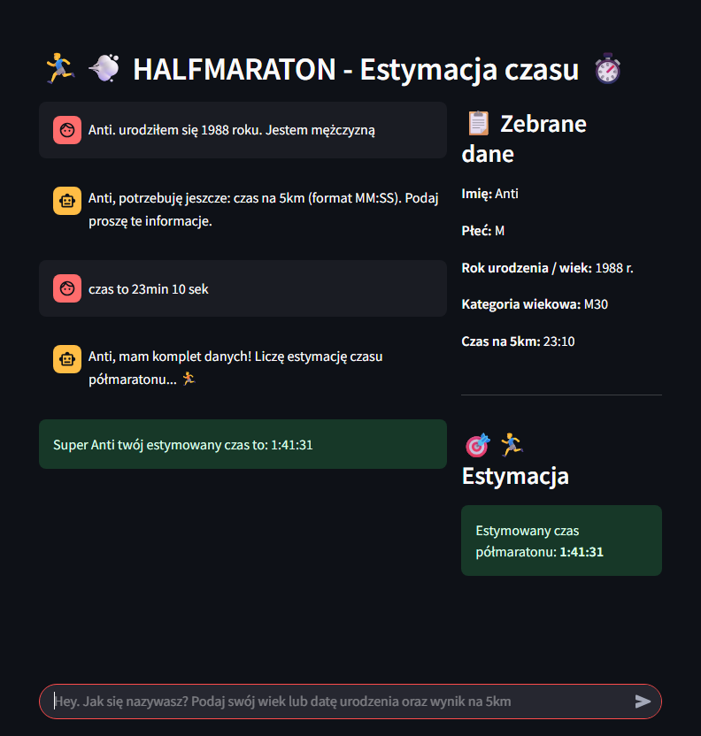
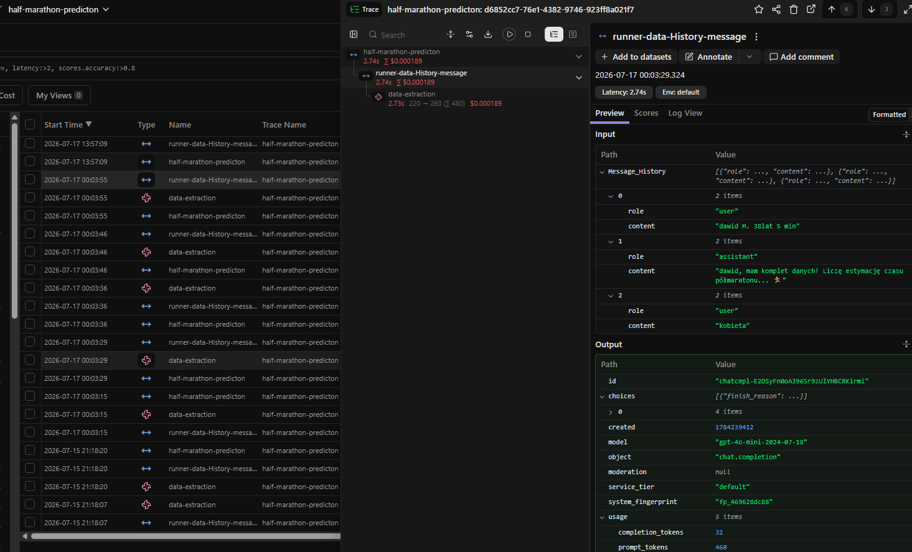

# 🏃 Half Marathon Approximation App


AI-powered application that predicts and approximates half marathon finish times based on natural language input using a Machine Learning model and an LLM.

## 🌐 Live Demo

**Application:** https://half-marathon-aprox-app-drxfd.ondigitalocean.app/

## 📷 Preview



## 📌 Project Overview

**half-marathon-aprox-app** is an intelligent web application designed to approximate and predict a runner's half marathon finish time based on natural language text or specific running parameters. 

The application seamlessly combines:
- **Machine Learning (Regression):** To calculate and approximate precise finish times based on historic running data.
- **OpenAI GPT-4.1 Mini:** For parsing raw text and extracting structured user features (age, gender, reference times).
- **Langfuse:** For full LLM call tracking, cost evaluation, and prompt observability.
- **DigitalOcean Spaces:** As secure storage for pre-trained prediction models.
- **Streamlit:** To provide a swift, responsive, and responsive user interface.

## 🚀 Features

- Predict and approximate half marathon finish times.
- Accept natural language input (e.g., *"Jestem 30-letnim mężczyzną, biegam 5 km w 21 minut"*).
- Smart extraction of runner telemetry (gender, age, 5k/10k times) via GPT.
- Missing information validation with interactive feedback.
- Automated model download from DigitalOcean cloud storage at startup.
- Full LLM request monitoring & tracing via Langfuse.
- Production-ready deployment on DigitalOcean App Platform.

## 🛠 Tech Stack

- Python
- Pandas / NumPy
- Streamlit
- Scikit-learn
- OpenAI API
- Instructor / Pydantic
- Langfuse
- Boto3 (DigitalOcean Spaces integration)
- DigitalOcean App Platform

## 🏗 Architecture

```
                User Input (Natural Language)
                            │
                            ▼
                  Streamlit Application
                            │
                            ▼
           OpenAI GPT-4.1 Mini + Instructor
                            │
                            ▼
            Structured Runner Information 
             (Age, Gender, Baseline Times)
                            │
                            ▼
     Regression Model (Loaded from DO Spaces)
                            │
                            ▼
         Predicted Half Marathon Finish Time
```

## 📁 Project Structure

```text
half-marathon-aprox-app/
│
├── app.py                  # Streamlit application core & UI
├── llm.py                  # LLM integration & prompt processing
├── predictor.py            # Model loading & inference logic
├── utils.py                # Mathematical approximations & helper functions
├── langfuse_client.py      # Langfuse observability config
├── requirements.txt        # Project dependencies
│
├── data/
│   ├── halfmarathon_wroclaw_2023_final.csv
│   └── halfmarathon_wroclaw_2024_final.csv
│
├── models/
│   └── halfmarathon_linear_regression.pkl
│
└── README.md
```

## ⚙️ How It Works

1. **Input:** The runner enters a casual sentence describing their profile and recent results.
2. **Extraction:** GPT analyzes the text and returns structured fields: `gender`, `age`, and `baseline_time`.
3. **Validation:** The application checks if the baseline metrics are sufficient to make an accurate approximation.
4. **Prediction:** The pre-trained scikit-learn regression model computes the predicted half marathon time.
5. **Output:** The dynamic result (including expected kilometer splits) is beautifully presented on screen.
6. **Telemetry:** Every LLM interaction logs prompts, response times, and token cost to Langfuse.

## 💬 Example

### Input
> Mam 28 lat, jestem facetem i biegam 5 km w 22 minuty.

### Output
```text
Predicted half marathon time:
01:43:58
```

### Missing Information Handling
Input:
> Mam 28 lat i jestem mężczyzną.

Output:
```text
Missing information required for calculation:
- 5 km time / reference distance time
```

## 📊 LLM Monitoring

Using Langfuse integration, the application monitors:
- Prompts & generation behaviors
- Output validation tokens
- Latency and latency patterns
- Exact usage tracking and estimated model API cost



## ☁️ Deployment

The application is deployed on **DigitalOcean App Platform** for high availability. 
The underlying Machine Learning models are securely maintained inside **DigitalOcean Spaces** and automatically initialized upon application container startup.

## 🔮 Future Improvements

- Support for varying custom race distances (10k, Marathon).
- Comparison view across multiple approximation formulas (Riegel vs. ML model).
- User historical runs and prediction tracking database.
- REST API implementation for third-party integrations.

## 📄 License

This project is available for educational and portfolio purposes.

## 👨‍💻 Author

GitHub: **@agentsDawid**
